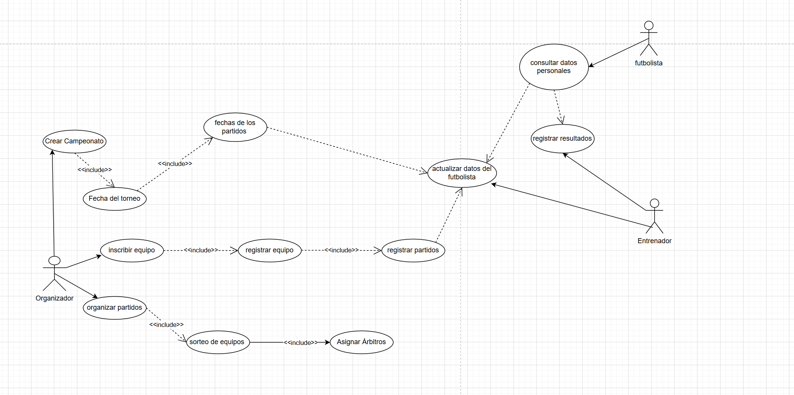
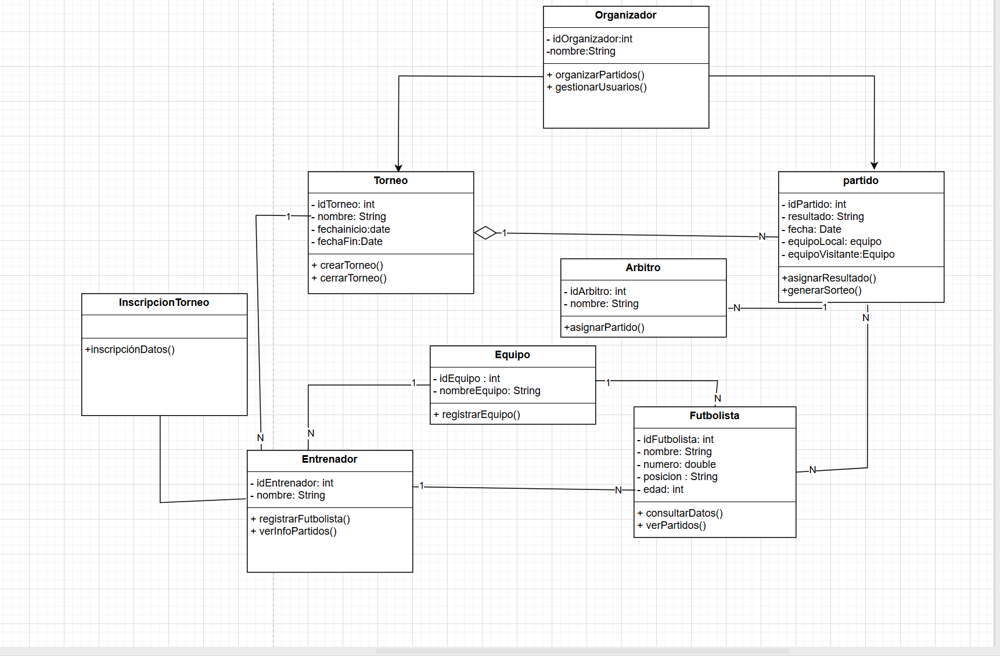

# Sistema de Gestión de Torneos de futbol

## Autor

Cristian Osso Parra

## Descripción del Proyecto

Trabajo para la asignatura de entornos en el que he creado una aplicación de gestión de torneos de futbol para lo cual he usado UML y Java. En UML he creado un diagrama de clases y uno de usos.

En cuanto a los actores, encontré tres actores, el administrador entrenador y futbolista.

## Diagramas UML

### Diagrama de Casos de Uso

### Diagrama de Clases

## Instalación y Ejecución

1.Clonar el repositorio: git clone git@github.com:cristian0612/AD-3-uml.git

## Justificación del Diseño

En el diagrama de casos de usos encontramos los siguientes casos: Registrar jugador, Añadir jugadores a un equipo, Registrar equipo, Consultar lista de equipos y jugadores. Decidí incluir el caso de uso de "registrar jugador" ya que no creo que sea posible anadir jugadores a un equipo sin antes haber registrado a los propios jugadores, considero que todos los casos de uso son independientes ya que tu puedes realizar cada uno de ellos de forma individual. El único actor que encontré es el Admin(administrador) el cual es el encargado de realizar cada una de las acciones.

## Conclusiones

Este proyecto me ha servido para entender mucho mejor UML y su representación con los diagramas de uso y clases al implementarlo con Java, ya que viendo solo el diagrama no me aclaraba mucho las ideas, ha sido al desarrollarlo en Java que realmente he entendido como representarlo en los diagramas. Además con este proyecto he entendido mucho mejor como organizar el codigo en distintas capas y que función tiene cada parte del proyecto.
